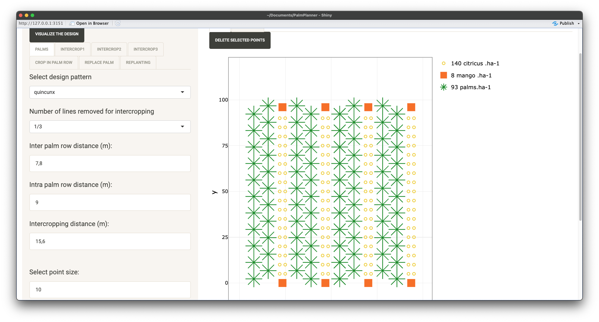

# Summary

This paper presents a Shiny application to design and visualize to scale intercropping systems based on oil palm cultivation. The application features an interactive user interface that enables users to select various design patterns for oil palm, manage the number of rows to be removed for intercropping, and adjust the spacing between plants. Users can position intercrops or trees in lines or distribute them sparsely, either between or within the rows of oil palm. The primary objective is to streamline the planting and replanting process by providing access to the spatial arrangement of plants, estimating final density, and preventing the planting of new plants in areas previously occupied by oil palms during replanting.

# Statement of need

This application was developed as a tool for assisting farmers and researchers in designing innovative agroforestry systems in the context of the Optipalmex project [@Optipalmex], which aimed at supporting the creation of a network of oil palm plantations in Mexico. The application enables users to rapidly visualize different design of planting systems and assist them to better harness potential difficulties during the planting process. The output map can be used to estimate the coordinates of each plant relatively to a reference tree, assess the number of plants required for the planting,  prevent the co-location of new plants in stumps from felled old palms for replanting, and estimate the final density of each species. This application can also serve as a support tool for studies which investigate the representation of targeted ecosystem services in existing intercropped and agroforestry systems, by introducing the concept of Ecosystem Services functional Spatial Unit [@rafflegeau2023essu].
Furthermore, future enhancements could include the exportation of the map with the typology of each species, as an input for more complex simulation models that simulate light on 3D plants [@perez2022architectural]. Such development could provide valuable insights into the competition for light among the species in the intercropped system and enhance users' ability to select plant spacing designs.

# App Features

The application is built using R and the Shiny framework [@shiny], incorporating several packages to enhance functionality and user experience. The Shiny app load functions coded in the script helpers_App_Design.R. These functions allow the creation of a design with the (x,y) coordinates of plants based on input arguments given by the user interface. The user interface is designed using a navbarPage layout, featuring multiple tabs that allow users to input arguments for oil palm and intercrop designs. Each tab contains input fields for each species such as:

- Selection of design patterns (e.g., square or quincunx, number of rows).
- Specification of distances between plants (both inter and intra-row).
- Customization of visual elements, including point sizes, colors and name of intercrops.

The interactive features allow to integrate until five species (crops or associated trees). Three tabs permit to design species between oil palms rows (intercrop), one tab for species within oil palm rows (crop in palm row), and a last tab for species to replace specific palms identified in the design (see Figure 1). The selection of specific palms can be done directly through interactive selection of the plots by using click or the lasso/box tool provide by the renderPlotly function. 
In a similar way every point can be selected from the plot. The selected points are listed into a table, from which a deletion procedure can be applied when needed for specific designs.

All specific interactive procedures are detailed in the README.md provided on the github repository.

# Use-case

In the context of the OptiPalMex project, the PalmPlanner application was utilized to create designs for each farmer involved in the project. Subsequently, before planting, farmers received an overview of their fields and had the opportunity to adjust the designs as needed. The use of the application during this phase enabled the development of new features to better address farmers' requests. Figure 2 presents examples of project designs that incorporate various features (Figure 2A: intercropping tabs, Figure 2B: replanting and replacing palms, Figure 2C: intercropping and planting in palm rows).

![Figure 2: Examples of designs generated with PalmPlanner. A) Double rows of oil palms planted following a quincunx design (intra-row = 9m, inter-row = 7.8m) and removing 1/3 oil palm row, intercropped with two cocoa rows following a quincunx design (intra-row = 3m, inter-row = 3m) and one row of bananas (intra-row = 9m). B) Square oil palm design (intra-row = 9m, inter-row = 9m) on replanting area (quincunx; intra-row = 9m, inter-row = 7.8m) with cedar trees replacing oil palm on the edges of the plot. C) Oil palm quincunx design (intra-row = 12m, inter-row = 8m) with one annual crop (beans) within the row (intra-row = 1.5m) and another one (maize) between rows of oil palm (intra-row = 2m). \label{fig:figure2}](images/Exemples.png)

# Acknowledgements

We acknowledge the contributions of the R community and the developers of the Shiny framework for providing the tools necessary to create this application. This work was support by the Optipalmex project funded by FASEP/PalmElit

# References
